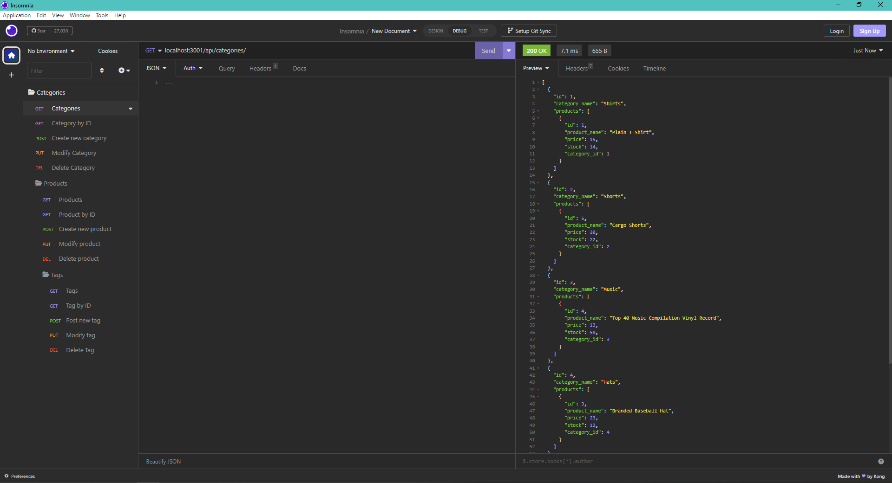

# E-commerce Back End Starter Code []

## Description

This is a E-commerce backend application where you can GET, POST, PUT, or DELETE data from the database, Insomnia was used in the demo to demostrate how to execute requests.

## URL demo

https://drive.google.com/file/d/1fRJG44__W7m87EZixdEwFnps69lIe_tB/view?usp=sharing

## Table of Contents

- [Technologies](#technologies)
- [Installation](#installation)
- [Usage](#usage)
- [License](#license)
- [Questions](#questions)

## Technologies

- Javascript
- Node.js
- Express.js
- SQL
- Sequelize
- Insomnia
- mySQL

## Installation

npm i -> mysql -uroot -p then enter your password -> source db/schema.sql -> exit; -> npm run seed -> npm start

## Usage

You can test and modify the data of the database using Insomnia (GET, POST, PUT, DELETE)

## License

[]

## Questions

Github: <andyanza>
